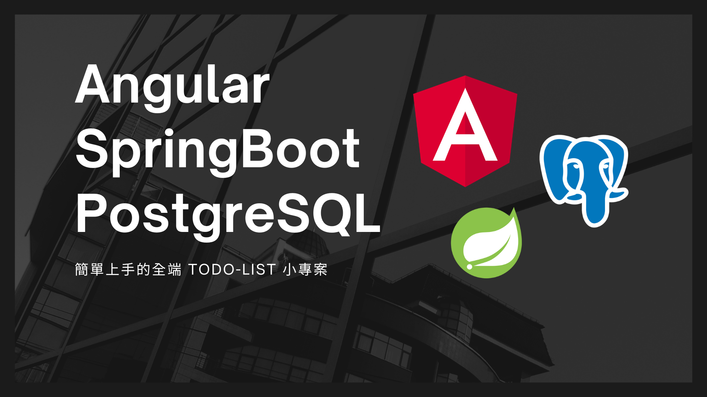

# Angular + Spring Boot + PostgreSQL Todo List



一個使用 **Angular (Standalone 架構)** 與 **Spring Boot 3 + PostgreSQL** 所構建的全端 Todo List 專案，實作最基本的 CRUD 功能，並採用 RESTful API 串接前後端。此專案適合用來作為個人作品集、全端練習、或進一步擴充成多人系統。

---

### 🚀 專案特色

- 前端使用 Angular Standalone 元件設計，模組化清晰
- 後端為 Spring Boot 3 + Spring Data JPA + PostgreSQL
- 實作完整的 Todo CRUD 功能：新增、刪除、修改、標記完成
- 使用 CORS 設定串接本地 API ( `localhost:8080` )
- 可用於部署或進階開發（例如：登入驗證、使用者分類等）

---

### 📁 專案結構

```
Angular-SpringBoot-ToDoList/
├── back-end/            # Spring Boot 應用程式
│   ├── src/main/java/com/example/myproject
│   │   ├── controller/TodoController.java
│   │   ├── entity/Todo.java
│   │   ├── repository/TodoRepository.java
│   │   └── service/TodoService.java
│   └── resources/
│       └── application.properties
│
├── front-end/           # Angular Standalone 專案
│   ├── src/app/features/todo/todo-list/
│   │   └── todo-list.component.ts/html/css
│   ├── app.config.ts
│   ├── main.ts
│   └── index.html
│
└── README.md
```

---

### 🛠️ 開發環境

| 技術 | 版本 |
|------|------|
| Angular | 17+ (使用 Standalone Components) |
| Spring Boot | 3.4.x |
| Java | 17 |
| PostgreSQL | 15+ |
| Node.js | 18+ |
| Git | 管理版本控制 |

---

### ⚙️ 快速啟動

### ✅ 前端啟動
```bash=
cd front-end
npm install
ng serve --open
```
網址會自動打開：http://localhost:4200

### ✅ 後端啟動
```bash=
cd back-end
mvn spring-boot:run
```
API 會在：http://localhost:8080/api/

---

### 🔗 API 規格（Spring Boot）

| 方法 | 路徑 | 說明 |
|------|------|------|
| GET | `/api/getAllTodos` | 取得所有 todo |
| POST | `/api/createTodo` | 新增 todo |
| PUT | `/api/updateTodo/{id}` | 修改 todo |
| DELETE | `/api/deleteTodo/{id}` | 刪除 todo |

---

### 📌 備註與延伸功能

- ✅ 支援 CORS，前後端可跨域連接
- ✅ 自動建表功能，啟動時自動產生 `todos` 表格
- 📌 待加入：過濾條件、日期分類、登入驗證、Firebase deploy...

---

### ✨ 作品集用途

本專案可作為：
- 前端 Angular 技術展示
- 後端 Spring Boot API 架構示範
- 獨立開發全端應用的能力呈現

---

### 🙋‍♂️ 作者

Ray / @ZhaoMeap  
[GitHub](https://github.com/ZhaoMeap)